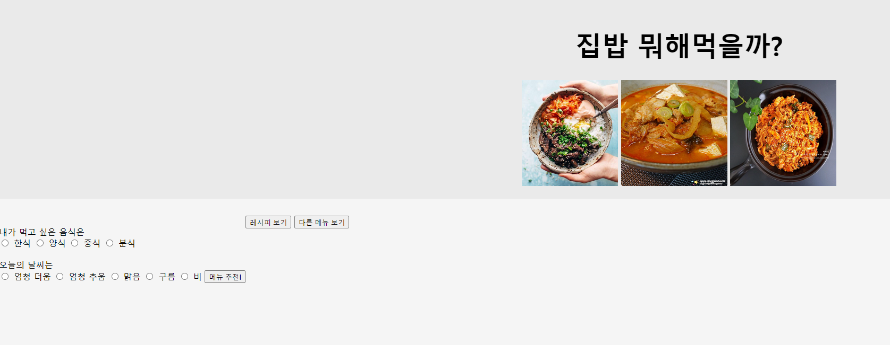

# <집밥 레시피 제공 서비스>
- 집에서 간단하게 요리 할 수 있는 요리를 추천하고, 레시피를 제공하는 서비스

## 1. 목표와 기능

### 1.1 목표
- 물가 상승과 배달 음식에 피로감을 느끼는 현대인들을 위해 간단하게 요리 할 수 있는 메뉴들을 추천
- 메뉴 추천으로 선택에 대한 피로감 해소
- 사용자 데이터 저장을 위한 백엔드 API 설계

### 1.2 기능
- 메뉴 선택에 가장 영향을 많이 끼치는 날씨를 기준으로 메뉴 추천
- 메뉴 선택과 동시에 간편한 레피시 추천으로 누구나 손쉽게 요리를 가능하게 함
- 보유하고 있는 재료로 요리를 가능하게 레시피를 추천

## 2. 개발 환경 및 배포 URL
### 2.1 개발 환경
- HTML, CSS, 자바스크립트
### 2.2 배포 URL
-https://hoyonzz.github.io/Project01/
-부트캠프 종료로 인해 Gpt API가 끝나 배포 종료하였습니다.

### 3.2 개발 일정(WBS)
- 아이디어 도출 -> 아이디어 맞게 일정 수립 -> HTML로 UI구축 -> CSS로 디자인 -> JS 코드 연결

### 4. 개발하며 느낀점
- 처음 아이디어 도출 시, 아이디어는 금방 도출 되었다. 하지만 어떤 식으로 프로그램을 개발해야 할지 방향성에 대한 고민을 오래하게 되었다.
- HTML, CSS, JS에 대한 공부가 부족해서 다시 인프런 강의를 처음부터 들었다. 배운것을 모두 사용하고 정리가 되어야 한다는 착각을 해서 실질적으로 개발에 대한 부족함이 많이 생겼다.
- 실제적으로 개발하면서 추가해야할 부분이 많아졌다. 추가할 부분이 많아지다보니 꼬이기 시작했다. 얼른 고치고 디자인 부분을 추가하고 싶었지만, 기능들이 제대로 수행해야 할것 같아서 기능부분부터 수정하고있다.
- 메뉴를 추천받고, 마음에 드는 메뉴를 입력하여 레시피를 추천받는 방향으로 가고 싶었는데, 버튼을 하나씩 빼다보니 기본적인 기능들도 작동하지 않기 시작되었다.
